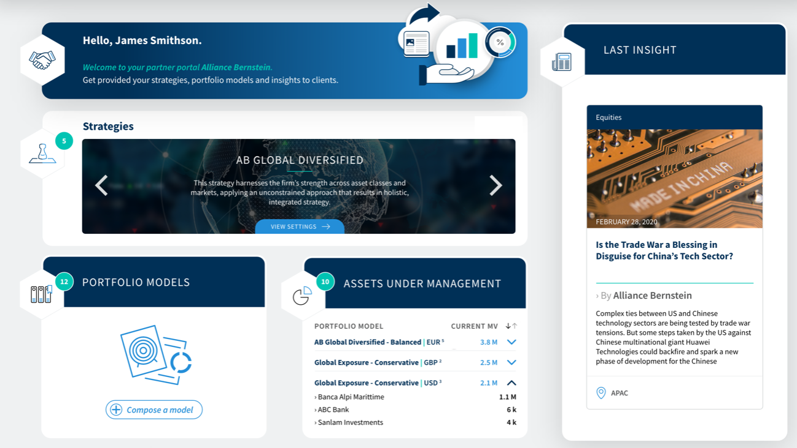

# INFINE France SAS - Test For Front End Developers

This test consists on reproducing the sample provided on the Result.png
The `Inifne Team` is working with the UI/UX designer which provide a PNG Display. 
The `Development Team` has to transform this Picture into Html content. 
The project has a dashboard angular component which has to contain the Html and Css code related to the Result.png Dashboard sample.
And you must include this component into the app.component.html.

You also must respect the branding colors of the final customer provided on the Branding Colors.png
You must also use the default font for the whole website provided on the style.scss file from the assets folder.

All necessary images are provided in the assets/images folder

## When you are confident with your result please push the changes on a branch named with your name

# TestFrontEnd

This project was generated with [Angular CLI](https://github.com/angular/angular-cli) version 8.3.14.

## Development server

Run `ng serve` for a dev server. Navigate to `http://localhost:4200/`. The app will automatically reload if you change any of the source files.

## Build

Run `ng build` to build the project. The build artifacts will be stored in the `dist/` directory. Use the `--prod` flag for a production build.
